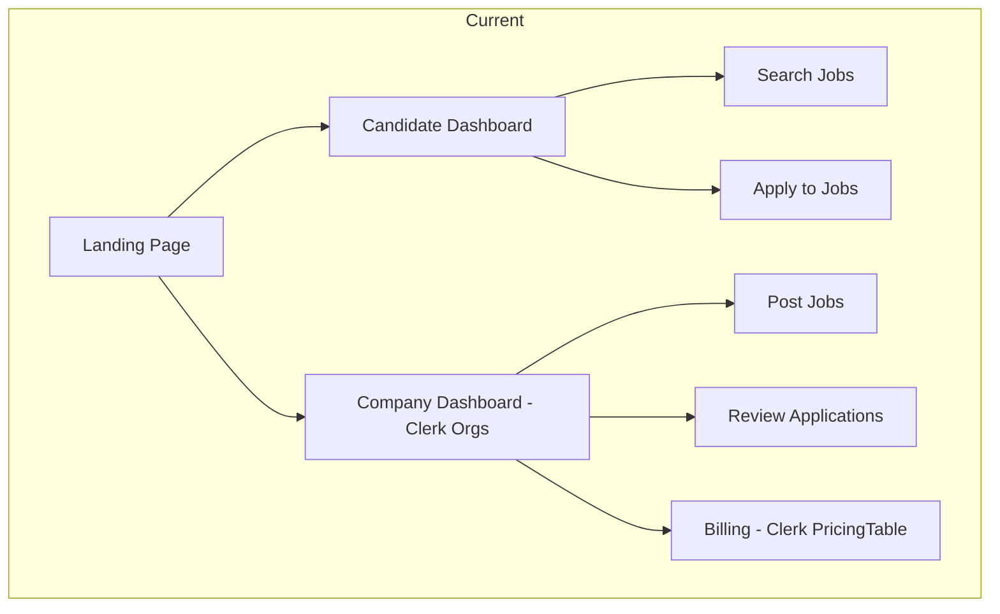
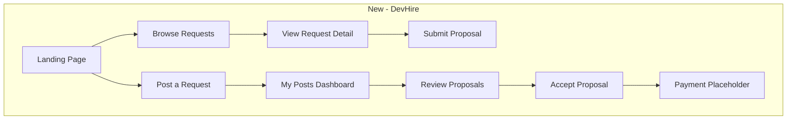
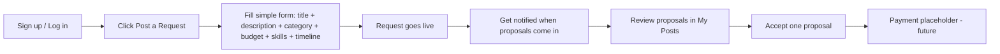
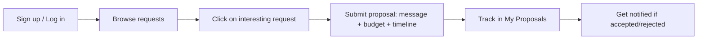

# DevHire - Freelance Developer Hiring Platform

## Transformation Plan: Indeed Clone → DevHire

---

## 1. Project Overview

### What We Have (Current - "Jobly")
A full-featured job board with two distinct sides:
- **Candidate side** (`app/(app)/`): Browse jobs, apply with resumes/cover letters, save favorites
- **Company side** (`app/company/`): Org-based dashboard, post jobs, review applications, billing plans
- **Auth**: Clerk with Organizations + Billing (PricingTable, plans: free/starter/growth)
- **Backend**: Convex (realtime DB + serverless functions)
- **Webhooks**: Clerk → Convex sync for users, organizations, memberships

### What We Want ("DevHire")
A dead-simple platform where anyone can post a request for a developer, and developers respond with proposals. Think of it like Facebook group hiring posts, but structured and inside a dedicated platform.

**Core flow:**
```
Poster creates request → Developers browse → Developer submits proposal → Poster reviews → Poster accepts a proposal
```

### Key Decisions from FAQs
1. Developers can only **propose** (no "I'm available" offer posts)
2. Dedicated **proposal system** inside the platform (not comment/DM style)
3. Only **one person** can represent a company (no multi-member orgs)
4. **Strip billing entirely** for now, but keep room for a custom payment gateway later (bKash, Nagad, Rocket, etc.)

---

## 2. Architecture Changes

### High-Level Architecture (Current vs New)





### What Gets Removed
| Component | Reason |
|-----------|--------|
| Clerk Organizations | No multi-member companies; just individual users |
| Clerk Billing / PricingTable | Custom payment gateway coming later |
| `OrganizationSwitcher` component | Not needed |
| `app/company/` entire directory | Replaced with simpler poster dashboard |
| `app/pricing/` page | Removed; payment is custom later |
| `convex/companies.ts` | Replaced with optional org-name on user profile |
| `convex/sync.ts` org webhook handlers | Only user webhooks remain |
| Company members system | Single-user accounts only |
| Resume/certification/education tables | Overkill for this platform; simplified profile |
| `Protect` role-based guards | No org roles needed |

### What Gets Kept and Adapted
| Component | Adaptation |
|-----------|-----------|
| Clerk auth (sign-in/sign-up) | Keep as-is for user auth |
| User webhook sync | Keep user.created/updated/deleted |
| Convex backend | Rewrite mutations/queries for new schema |
| Notification system | Adapt notification types for proposals |
| Favorites system | Keep as "saved requests" |
| Search with full-text index | Adapt for request posts |
| Rich text editor (TipTap) | Keep for request descriptions |
| shadcn/ui components | Keep all UI primitives |
| Responsive layout with mobile nav | Keep pattern, change nav items |

---

## 3. New Database Schema

### Tables to Remove
- `companies`
- `companyMembers`
- `experiences`
- `education`
- `certifications`
- `resumes`

### Tables to Keep (Modified)
- `users` - unchanged
- `profiles` - simplified
- `notifications` - new types
- `favorites` - point to requests instead of jobListings

### Tables to Rename/Rewrite
- `jobListings` → `requests`
- `applications` → `proposals`

### New Schema Design

```
users (unchanged)
├── clerkUserId: string
├── email: string?
├── firstName: string?
├── lastName: string?
├── imageUrl: string?
├── createdAt: number
└── updatedAt: number

profiles (simplified)
├── userId: Id users
├── firstName: string?
├── lastName: string?
├── headline: string?         // e.g. "Business Owner" or "Full-Stack Developer"
├── bio: string?              // short about-me
├── location: string?
├── phone: string?
├── website: string?
├── githubUrl: string?
├── skills: string[]          // relevant for devs proposing
├── companyName: string?      // optional: "I represent Acme Inc."
├── isdeveloper: boolean      // flag: are they a dev who proposes?
└── updatedAt: number

requests (replaces jobListings)
├── postedByUserId: Id users
├── posterName: string         // denormalized for display
├── companyName: string?       // optional org name
├── title: string              // e.g. "Fix React auth bug"
├── description: string        // rich text
├── category: union            // "bug_fix" | "new_project" | "feature" | "consultation" | "hiring" | "other"
├── budgetType: union          // "fixed" | "hourly" | "negotiable"
├── budgetMin: number?
├── budgetMax: number?
├── budgetCurrency: string?    // default "BDT"
├── timeline: union            // "urgent" | "within_a_week" | "within_a_month" | "flexible"
├── skillsNeeded: string[]
├── searchText: string         // full-text search field
├── isOpen: boolean
├── proposalCount: number
├── createdAt: number
├── updatedAt: number
└── closedAt: number?

proposals (replaces applications)
├── requestId: Id requests
├── proposerUserId: Id users
├── proposerName: string       // denormalized
├── status: union              // "pending" | "accepted" | "rejected" | "withdrawn"
├── message: string            // the pitch/proposal text
├── proposedBudget: number?
├── proposedTimeline: string?  // e.g. "3 days", "1 week"
├── decidedAt: number?
├── createdAt: number
└── updatedAt: number

favorites (adapted)
├── userId: Id users
├── requestId: Id requests     // was jobId
└── createdAt: number

notifications (adapted types)
├── userId: Id users
├── type: union                // "proposal_received" | "proposal_status" | "request_closed" | "system"
├── title: string
├── message: string
├── linkUrl: string?
├── metadata: any?
├── isRead: boolean
├── readAt: number?
└── createdAt: number

payments (NEW - placeholder for future)
├── requestId: Id requests
├── proposalId: Id proposals
├── payerUserId: Id users
├── payeeUserId: Id users
├── amount: number
├── currency: string
├── method: string?            // "bkash" | "nagad" | "rocket" | etc.
├── transactionId: string?
├── status: union              // "pending" | "completed" | "failed" | "refunded"
├── createdAt: number
└── updatedAt: number
```

---

## 4. New Route Structure

### Routes to Remove
```
app/company/                    → entire directory
app/company/layout.tsx
app/company/page.tsx
app/company/actions.ts
app/company/_components/*
app/company/applications/*
app/company/billing/*
app/company/jobs/*
app/pricing/                    → entire directory
app/server/                     → remove if unused
```

### Routes to Keep and Modify
```
app/layout.tsx                  → remove ClerkProvider org config
app/page.tsx                    → rebrand landing page
app/(app)/layout.tsx            → update nav items
app/(app)/jobs/page.tsx         → becomes /requests (browse)
app/(app)/jobs/[jobId]/page.tsx → becomes /requests/[requestId]
app/(app)/applications/page.tsx → becomes /proposals (my proposals)
app/(app)/favorites/page.tsx    → adapt to saved requests
app/(app)/notifications/page.tsx→ keep, update types
app/(app)/profile/page.tsx      → simplify profile form
app/sign-in/                    → keep as-is
app/sign-up/                    → keep as-is
```

### Routes to Add
```
app/(app)/post/page.tsx              → create a new request (simple form)
app/(app)/my-posts/page.tsx          → list my posted requests
app/(app)/my-posts/[requestId]/page.tsx → view my request + its proposals
app/(app)/requests/page.tsx          → browse all open requests
app/(app)/requests/[requestId]/page.tsx → view request detail + submit proposal
```

### New Nav Structure
**Top nav items:**
- Browse (requests feed)
- Post a Request (big CTA button)
- My Posts (poster's dashboard)
- My Proposals (developer's sent proposals)
- Saved

**Mobile bottom nav:**
- Browse
- Post
- My Posts
- Proposals
- Saved

---

## 5. User Flow Diagrams

### Poster Flow


### Developer Flow


---

## 6. Detailed Implementation Steps

### Phase 1: Strip and Clean
1. Remove `app/pricing/` directory entirely
2. Remove `app/company/` directory entirely
3. Remove `app/server/` directory
4. Remove Clerk Organization imports and components from `app/layout.tsx`
5. Remove `OrganizationSwitcher`, `Protect` (role-based), `PricingTable` usage everywhere
6. Remove `convex/companies.ts`
7. Remove org-related webhook handlers from `convex/http.ts` (keep only user.created/updated/deleted)
8. Remove org-related sync functions from `convex/sync.ts`
9. Remove `convex/lib/companies.ts`
10. Remove `app/company/_components/sync-company-plan.tsx`, `billing-section.tsx`, `billing-usage-cards.tsx`, `invite-member-section.tsx`

### Phase 2: Rewrite Schema
11. Rewrite `convex/schema.ts` with new tables: remove companies, companyMembers, jobListings, applications, experiences, education, certifications, resumes
12. Add new tables: requests, proposals, payments (placeholder)
13. Simplify profiles table (remove linkedinUrl, yearsExperience, openToWork; add companyName, isDeveloper)
14. Update favorites to reference requestId
15. Update notifications with new type literals

### Phase 3: Rewrite Backend Functions
16. Create `convex/requests.ts`:
    - `createRequest` mutation
    - `getRequestById` query
    - `listOpenRequests` query (with search + filters)
    - `listMyRequests` query (poster's own)
    - `closeRequest` mutation
    - `updateRequest` mutation
17. Create `convex/proposals.ts`:
    - `submitProposal` mutation
    - `listMyProposals` query (developer's sent proposals)
    - `listProposalsForRequest` query (poster sees proposals on their request)
    - `updateProposalStatus` mutation (accept/reject)
    - `withdrawProposal` mutation
18. Update `convex/favorites.ts` - change jobId references to requestId
19. Update `convex/notifications.ts` - change notification types
20. Update `convex/profiles.ts` - simplify to match new schema
21. Remove `convex/jobs.ts` and `convex/applications.ts`
22. Create `convex/payments.ts` (stub - just the table + basic queries for future use)

### Phase 4: Rewrite Frontend - Layout and Navigation
23. Update `app/layout.tsx` - remove org-related Clerk config, rebrand metadata
24. Rewrite `app/(app)/layout.tsx` - new nav items: Browse, Post, My Posts, Proposals, Saved
25. Update `components/site-logo.tsx` - new brand name

### Phase 5: Rewrite Frontend - Pages
26. Rewrite `app/page.tsx` (landing page):
    - New hero: "Find a developer for your project" / "Get hired for short-term dev work"
    - How it works: Post → Propose → Hire
    - Remove company logos, pricing references
    - Keep it dead simple
27. Create `app/(app)/post/page.tsx` (post a request form):
    - Title field
    - Description (rich text)
    - Category dropdown
    - Budget type + range
    - Skills needed (tag input)
    - Timeline dropdown
    - One big "Post Request" button
28. Create `app/(app)/requests/page.tsx` (browse requests):
    - Search bar
    - Filter by category, budget type, timeline
    - Card list of open requests
    - Save/unsave toggle
29. Create `app/(app)/requests/[requestId]/page.tsx` (request detail):
    - Full request info
    - "Submit Proposal" section (if not the poster)
    - Proposal form: message + proposed budget + proposed timeline
30. Create `app/(app)/my-posts/page.tsx` (poster dashboard):
    - List of my posted requests with status
    - Proposal count badge
31. Create `app/(app)/my-posts/[requestId]/page.tsx` (manage request):
    - View request details
    - List all proposals received
    - Accept/reject buttons per proposal
    - Close request button
32. Rewrite `app/(app)/applications/page.tsx` → `app/(app)/proposals/page.tsx`:
    - List of proposals I have submitted
    - Status badges (pending/accepted/rejected)
33. Update `app/(app)/favorites/page.tsx` - adapt to saved requests
34. Update `app/(app)/notifications/page.tsx` - new notification types
35. Simplify `app/(app)/profile/page.tsx`:
    - Basic info: name, headline, bio, location, phone, website, github
    - Skills (for developers)
    - Optional company name
    - "I am a developer" toggle
    - Remove: resume upload, experience history, education, certifications

### Phase 6: Payment Placeholder
36. Create `convex/payments.ts` with empty placeholder structure
37. Add a "Payment" section stub in the accepted-proposal view that says "Payment integration coming soon" with logos of bKash, Nagad, Rocket
38. Ensure the proposal-acceptance flow has a clear hook point where payment will be triggered

### Phase 7: Polish and Simplification
39. Review every page for simplicity - remove any confusing UI elements
40. Ensure the entire flow works without reading instructions:
    - Big obvious "Post a Request" button on homepage and nav
    - Clear "Submit Proposal" button on each request
    - Simple status indicators (Open/Closed, Pending/Accepted/Rejected)
41. Mobile-first responsive design pass
42. Update landing page copy for the new platform identity
43. Remove any leftover references to "jobs", "applications", "company", "employer", "recruiter"
44. Clean up unused dependencies: remove `svix` if webhooks simplified, review others

### Phase 8: Testing and Cleanup
45. Test complete poster flow: sign up → post request → receive proposals → accept one
46. Test complete developer flow: sign up → browse → propose → track status
47. Test notifications for both flows
48. Test search and filtering
49. Remove all dead code, unused imports, orphaned files
50. Update README.md with new project description

---

## 7. Files Impact Summary

### Files to DELETE
```
app/company/layout.tsx
app/company/page.tsx
app/company/actions.ts
app/company/_components/billing-section.tsx
app/company/_components/billing-usage-cards.tsx
app/company/_components/company-summary-cards.tsx
app/company/_components/invite-member-section.tsx
app/company/_components/sync-company-plan.tsx
app/company/applications/page.tsx
app/company/billing/page.tsx
app/company/jobs/page.tsx
app/company/jobs/[jobId]/edit/page.tsx
app/company/jobs/new/page.tsx
app/pricing/page.tsx
app/server/inner.tsx
app/server/page.tsx
app/app/page.tsx
convex/companies.ts
convex/jobs.ts
convex/applications.ts
convex/lib/companies.ts
convex/seed.ts
```

### Files to REWRITE (heavy changes)
```
convex/schema.ts              → new schema
convex/sync.ts                → remove org handlers
convex/http.ts                → remove org webhook routes
convex/profiles.ts            → simplified profile
convex/favorites.ts           → requestId instead of jobId
convex/notifications.ts       → new notification types
app/layout.tsx                → remove org config
app/page.tsx                  → new landing page
app/(app)/layout.tsx          → new navigation
app/(app)/favorites/page.tsx  → adapt to requests
app/(app)/notifications/page.tsx → new types
app/(app)/profile/page.tsx    → simplified form
```

### Files to CREATE
```
convex/requests.ts            → request CRUD + search
convex/proposals.ts           → proposal CRUD
convex/payments.ts            → placeholder
app/(app)/post/page.tsx       → post request form
app/(app)/requests/page.tsx   → browse requests
app/(app)/requests/[requestId]/page.tsx → request detail + propose
app/(app)/my-posts/page.tsx   → poster dashboard
app/(app)/my-posts/[requestId]/page.tsx → manage proposals
app/(app)/proposals/page.tsx  → my sent proposals
```

### Files UNCHANGED
```
components/ui/*               → all shadcn components
components/ConvexClientProvider.tsx
components/rich-text-editor.tsx
components/rich-text-display.tsx
components/notification-bell.tsx
lib/*                         → utility functions
app/sign-in/
app/sign-up/
convex/_generated/*
convex/auth.config.ts
convex/tsconfig.json
```

---

## 8. Simplicity Principles

The goal is "a 5-year-old can use it." Every design decision should pass this test:

1. **One action per screen** - each page has one obvious thing to do
2. **Big buttons** - primary actions are impossible to miss
3. **No jargon** - "Post a Request" not "Create Job Listing", "Send Proposal" not "Submit Application"
4. **Minimal forms** - only required fields visible; optional fields collapsed or on a second step
5. **Color-coded statuses** - green = open/accepted, yellow = pending, red = closed/rejected
6. **No org/company complexity** - you are just a person posting or proposing
7. **Mobile-first** - bottom nav, thumb-friendly tap targets, no tiny text
8. **Instant feedback** - toast notifications on every action, real-time updates via Convex

---

## 9. Payment Gateway Integration Points

While billing is stripped for now, these are the exact integration points for the custom payment gateway (bKash, Nagad, Rocket, etc.):

1. **Trigger point**: When a poster accepts a proposal, show a "Pay now" step before finalizing
2. **Data needed**: `payments` table stores amount, currency, method, transactionId, status
3. **API hook**: `convex/payments.ts` will have `initiatePayment` and `confirmPayment` mutations
4. **Webhook receiver**: A new HTTP route in `convex/http.ts` for payment gateway callbacks
5. **UI component**: A payment modal/page showing available methods with logos

The `payments` table is created now (empty) so the schema is ready when the gateway is integrated.

---

## 10. Naming / Branding Notes

- Platform name: To be decided (suggest "DevHire", "FixMyCode", "DevConnect" - user to choose)
- Primary color: Keep the existing warm palette or adjust
- Logo: Will need a new one (can use text logo initially)
- Tagline suggestion: "Post your problem. Get a developer."
